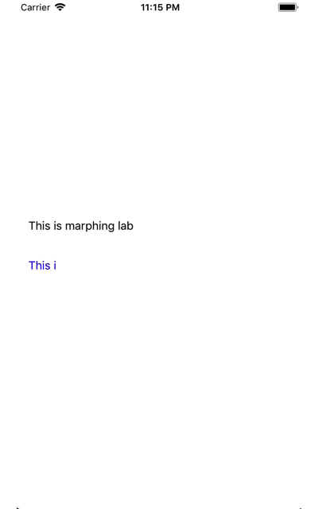

# MQMorphingLabel

[](https://travis-ci.org/mayqiyue/MQMorphingLabel)
[](http://cocoapods.org/pods/MQMorphingLabel)
[](http://cocoapods.org/pods/MQMorphingLabel)
[](http://cocoapods.org/pods/MQMorphingLabel)

## Purpose
I like to realize UI effects when I am free.
### And her is the effect.



## Example
You can clone or download the example to have fun with it.

To run the example project, clone the repo, and run pod install from the Example directory first.

## Installation

MQMorphingLabel is available through [CocoaPods](http://cocoapods.org). To install
it, simply add the following line to your Podfile:

```ruby
pod 'MQMorphingLabel'
```

## Usage

The API is very easy to use:

    - (void)playFromProgress:(CGFloat)fromProgress
                  toProgress:(CGFloat)toProgress
              withCompletion:(nullable MQMAnimationCompletionBlock)completion;

    - (void)playWithCompletion:(nullable MQMAnimationCompletionBlock)completion;

    - (void)play;

    - (void)stop;

## Author

mayqiyue, xu20121013@gmail.com

## License

MQMorphingLabel is available under the MIT license. See the LICENSE file for more info.
